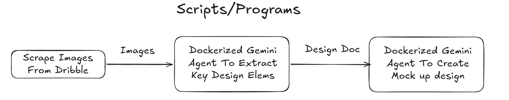

# Des-Brk
its Dez-Brk ;), but changed to des for design.        
the name explains how much it means to me :)


## Main Idea
welp i m bad at design, not that it matters anymore, and i thought of using dribble,  and i have a workflow where i send images to gpt thinking extended and let it extract the design elems and then send it to claude to create a mock up design then i will send the html to codex to generate react application, welp this app does the first 3 steps for you xD.      

anyhow my first idea was to scrape the whole database of dribble and save it locally since who needs creativity when ppl already design for you and you send it to a llmd but i ended up vibe coding the whole tool for some reason (i guess bc its easy :) ).

the tool is not prefect and uses basic scrapping of dribble and gemini as a agent but the idea is there


## Technical Details

anyhow i coded the `des-brk-micro`, which does 
- scrapping dribble website using playwright 
- running a dockerized  gemini agents in a docker container to "reverse" the design aka extract key elems from it and poop out a design doc
- running a dockerized gemini agent to generate the design and poop out a html doc 


frontend and backend are vibe coded.     
worth nothing elems are:
- there is sockets between backend-frontend and the scripts to signal when the agent finish hallucinating.    
- there a workspace system which allows for running multiple agents at time
- using dockers for the agent so it doesn't mess up the user system, and scalable for future agents 


## How to run
- install requirements.txt in backend
- install npm packages
- in Dockerfiles add your Gemini api key, and build the image with this cmd 
    - `docker build -t gemini .` in both the reverse and generation scripts
    - then start the backend and the frontend


## Youtube Demo
- https://www.youtube.com/watch?v=Q34Jl0nck1o


## Cool Illustrations:          
### Architecture
      
```
├── des-brk-backend
│   ├── app
│   ├── des_brk.db
│   ├── README.md
│   └── requirements.txt
├── des-brk-front
│   ├── src
│   └── vite.config.ts
│   └── .....
├── des-brk-micro
│   └── scrape-designs 
│   ├── reverse-designs
│   ├── generate-designs 
│   └── .....
├── README.md
└── resources

```

### Workflow



